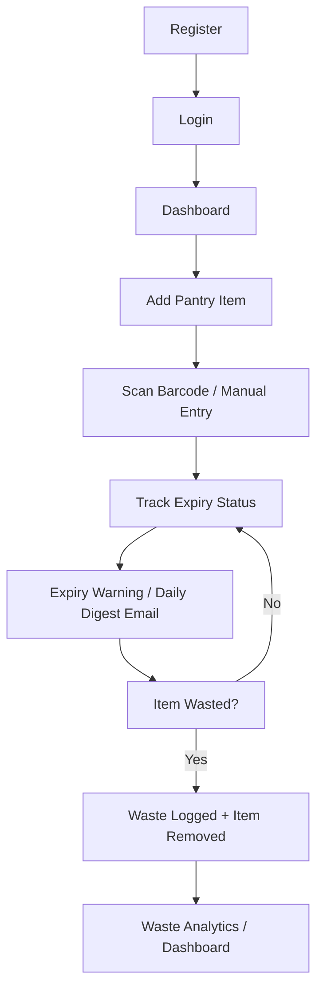

# Smart Expiry & Pantry Waste Tracker

Never waste food or medicine again. Track what's in your pantry, get a daily
email before things expire, and see exactly how much money you're losing to
spoiled food and expired medicine — a full-stack web app with a React SPA, a
Spring Boot API, and PostgreSQL, all deployed to the cloud.

## 🚀 Live Demo

| | |
|---|---|
| **Frontend** | https://smart-expiry-tracker-kappa.vercel.app |
| **Backend** | https://smart-expiry-tracker-pn5i.onrender.com |
| **API** | https://smart-expiry-tracker-pn5i.onrender.com/api |

(No secrets are included in this repository — all configuration is
documented as environment variable names only.)

---

## 1. Overview

**What it does** — users register, build a personal pantry inventory with
expiry dates, and the app automatically classifies every item as safe /
expiring soon / expired using a warning window configured per category
(medicines warn 7 days out, perishables 1 day).

**Problem it solves** — expiry dates are invisible until it's too late, and
households never measure what they throw away. This app provides proactive
email warnings and quantified waste analytics.

**Target users** — households reducing food/medicine waste, caregivers, and
anyone managing short-shelf-life items.

**Main purpose** — Track → Warn → Quantify: keep an inventory, get warned
before things expire, and see the money lost to waste.

---

## 2. Features

### 🔐 Authentication
- Email/password registration & login (BCrypt-hashed passwords)
- JWT access tokens (60 min) kept in browser memory only
- Refresh tokens (14 days) in an HttpOnly cookie, **rotated on every use**
  with generation-based revocation on logout
- Automatic session restore and single-flight token refresh on 401

### 🧺 Pantry Management
- Add / edit / delete items with name, category, quantity, unit, purchase &
  expiry dates, shelf life, and notes
- Search (debounced), category & status filters, 4 sort keys
- Responsive list — table on desktop, cards on mobile
- Unit suggestions per category; shelf-life auto-suggested from dates

### ⏰ Expiry Tracking
- Live status per item: `SAFE` / `EXPIRING` / `EXPIRED`
- Per-category warning windows (grocery 3, medicine 7, perishable 1 day)
- Dashboard "Needs attention" list and summary cards

### 🗂️ Categories
- Reference data seeded by migration: grocery, medicine, perishable

### 🗑️ Waste Management
- Mark items as wasted (whole or partial) with an estimated cost lost
- Historical snapshot (name + unit) survives item deletion
- Recent-waste feed on the dashboard

### 📊 Analytics
- Monthly waste trend chart + totals (items wasted, cost lost)
- 3 / 6 / 12-month ranges, monthly breakdown table, category donut

### 📷 Barcode
- Camera scanning with confirmation logic (no flaky reads)
- Barcode photo decode and manual entry with EAN-13/EAN-8/UPC-A validation
- Product lookup via Open Food Facts, **cached in PostgreSQL** so repeat
  scans are instant

### 📧 Notifications & Email
- Daily digest at 07:00 — one email per user listing only their own
  expiring/expired items
- Idempotent (each item is notified at most once per UTC day, even if job
  runs race)
- Dry-run mode without an API key; admin "Test digest now" trigger

---

## 3. Application Workflow



---

## Technology Stack

| Layer | Technology |
|---|---|
| Frontend | React 19 · TypeScript · Vite 6 · Tailwind CSS 4 · Chart.js · html5-qrcode |
| Backend | Java 21 · Spring Boot 3.5.16 · Spring Security · JPA · Flyway · JJWT |
| Database | PostgreSQL (Supabase, managed) |
| Email | Resend |
| Barcode data | Open Food Facts |
| Deployment | Render (API, Docker) · Vercel (SPA) |

## Project Structure

```
├── backend/      Spring Boot API (Docker image, Flyway migrations V1–V4)
├── src/          React frontend (pages, components, context, hooks, lib)
├── docs/         Complete documentation package (master doc + 27 guides)
├── vercel.json   SPA rewrite for Vercel
└── production-smoke-test.ps1   15-step production verification
```

## Getting Started

Backend:

```bash
cd backend
# Set env vars: DB_URL (jdbc:postgresql:...?sslmode=require), DB_PASSWORD, JWT_SECRET (≥32 bytes)
mvn spring-boot:run
```

Frontend:

```bash
npm install
Copy-Item .env.example .env   # set VITE_API_BASE_URL
npm run dev
```

See [docs/22-ENVIRONMENT-CONFIGURATION.md](docs/22-ENVIRONMENT-CONFIGURATION.md)
for every configuration variable (names and purpose only).

## Testing & Verification

- **Backend**: `mvn -B -ntp test` — 146 tests, 0 failures
- **Frontend**: `npm run build` (TypeScript check + production bundle)
- **Production smoke test** — 15 checks against the live API (15/15 PASS):

```powershell
powershell -NoProfile -ExecutionPolicy Bypass -File .\production-smoke-test.ps1
```

## 📚 Documentation

Full code-grounded documentation: [docs/README.md](docs/README.md) — index,
or the [master document](docs/SMART-EXPIRY-TRACKER-COMPLETE-DOCUMENTATION.md)
covering architecture, API, security, database design, deployment,
operations, and troubleshooting.