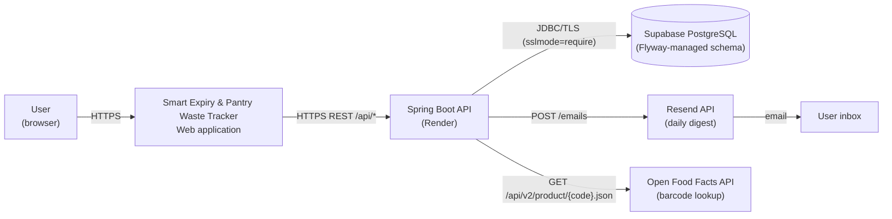
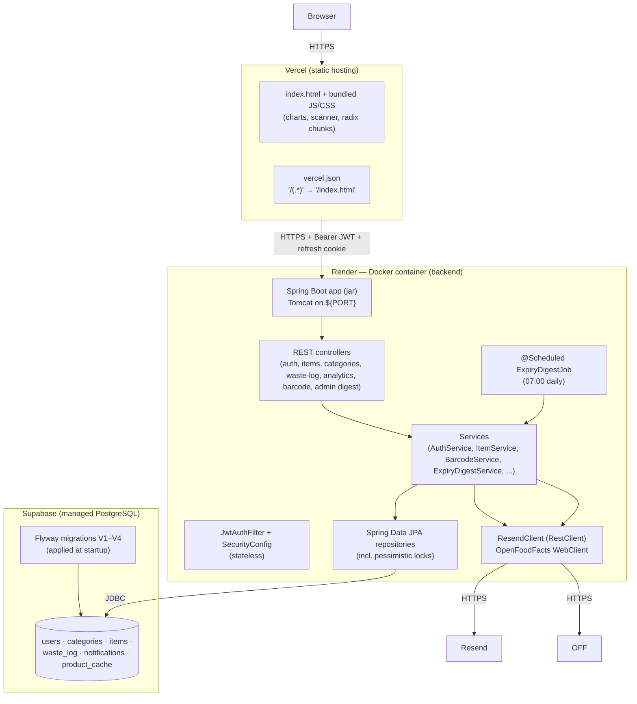
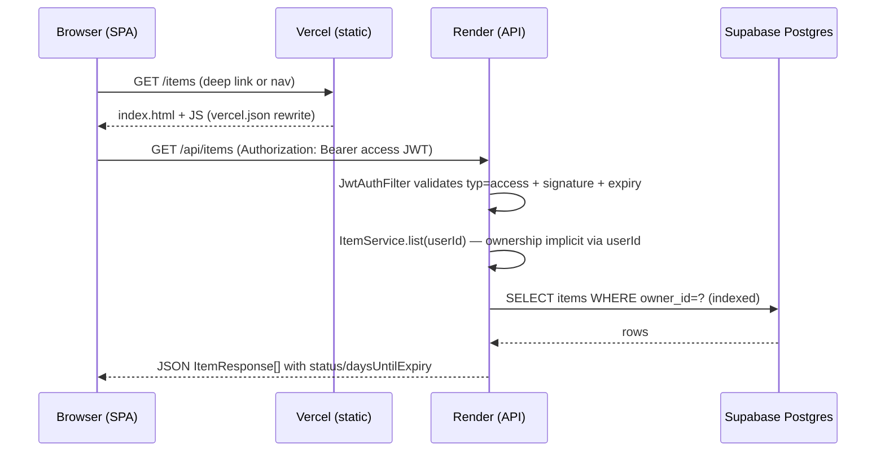
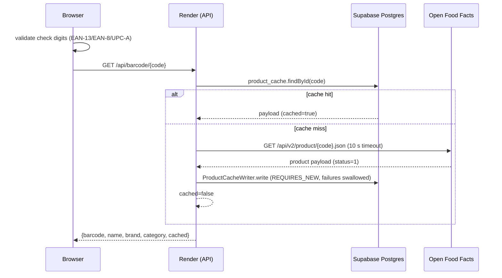

# 06 — System Architecture

## System context diagram



## Container architecture



## Request flow (authenticated read)



## Request flow (auth)

```mermaid
sequenceDiagram
    participant B as Browser
    participant R as Render (API)
    participant DB as Supabase Postgres
    B->>R: POST /api/auth/login {email, password}
    R->>R: AuthRateLimiter (5/min/IP) → BCrypt verify
    R->>DB: find user by email (lowercased)
    R->>R: issue access JWT (typ=access, 60 min) + refresh JWT (typ=refresh, gen)
    R-->>B: 200 {accessToken, user} + Set-Cookie refresh_token (HttpOnly, Path=/api/auth)
    B->>R: POST /api/auth/refresh (cookie only)
    R->>DB: SELECT user FOR UPDATE; gen match? → gen++
    R-->>B: 200 new pair + rotated cookie
```

## Digest flow (daily job)

```mermaid
sequenceDiagram
    participant J as @Scheduled job (07:00)
    participant S as ExpiryDigestService
    participant DB as Supabase Postgres
    participant R as ResendClient
    participant M as User mailbox
    J->>S: run()
    S->>DB: load all items (owner + category eager)
    S->>S: group by owner; skip SAFE/no-expiry/already-notified
    loop per user
        S->>R: sendDigest(user, expiring, expired)
        alt send OK
            S->>DB: record Notification per item (REQUIRES_NEW, unique index guards races)
        else send failed
            S-->>S: not recorded → retried next run
        end
    end
    R-->>M: one HTML email per user
```

## Data flow (barcode lookup)



## Architecture principles (from code)

1. **Stateless API** — JWT auth, no server sessions; any instance can serve
   any request.
2. **Ownership in the service layer** — `OwnershipGuard` + owner-scoped
   queries replace database RLS.
3. **Schema owned by Flyway** — `hibernate.ddl-auto=none`; migrations are the
   only way the schema changes.
4. **Single source of truth per concern** — statuses are computed on read,
   never stored; waste history is snapshotted at write time.
5. **Idempotent side effects** — digest emails and product-cache writes are
   safe under concurrency (unique index, `REQUIRES_NEW`).