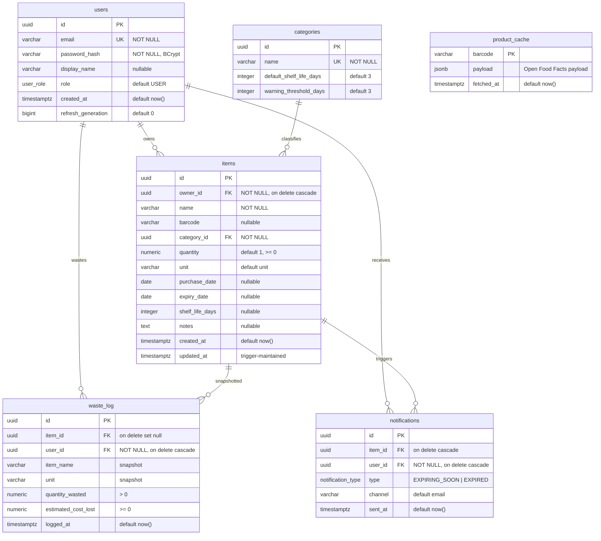

# 11 — ER Diagram

## Relationship semantics

| Relationship | Cardinality | Meaning |
|---|---|---|
| users → items | 1 : N | A user owns many items; deleting the user cascades to their items |
| categories → items | 1 : N | A category classifies many items; category deletion is NOT cascaded (FK only, categories are reference data) |
| items → waste_log | 1 : N (nullable) | Waste entries may reference the item; `ON DELETE SET NULL` keeps history when the item is deleted |
| users → waste_log | 1 : N | Waste log entries belong to the user; cascade on user delete |
| items → notifications | 1 : N | One item may be notified once per day per type; cascade on item delete |
| users → notifications | 1 : N | Notification audit per user; cascade on user delete |
| product_cache | standalone | Key-value cache (barcode → JSON payload); no FK relationships |

## Indexes (from V1)

| Index | On | Purpose |
|---|---|---|
| `items_owner_expiry_idx` | items(owner_id, expiry_date) | Fast per-user listing ordered by expiry |
| `items_barcode_idx` | items(barcode) | Item lookup by barcode |
| `waste_log_user_idx` | waste_log(user_id, logged_at DESC) | Recent-waste feed per user |
| `notifications_dedup_idx` (UNIQUE) | notifications(item_id, type, date_trunc('day', sent_at, 'UTC')) | Digest idempotency |
| `notifications_user_idx` | notifications(user_id, sent_at DESC) | Notification audit per user |

## Constraints summary

- Check constraints: `items.quantity >= 0`, `waste_log.quantity_wasted > 0`,
  `waste_log.estimated_cost_lost >= 0`.
- Unique constraints: `users.email`, `categories.name`, `product_cache.barcode`
  (PK), the dedup unique index.
- Foreign keys: `items.owner_id → users (CASCADE)`,
  `items.category_id → categories`,
  `waste_log.item_id → items (SET NULL)`,
  `waste_log.user_id → users (CASCADE)`,
  `notifications.item_id → items (CASCADE)`,
  `notifications.user_id → users (CASCADE)`.