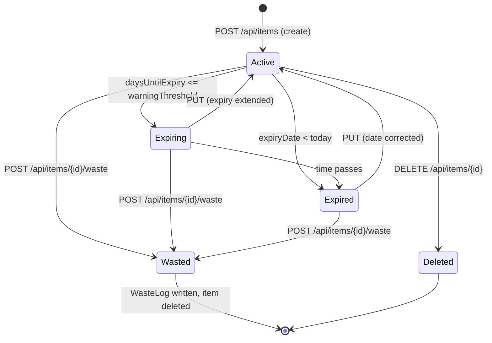

# 15 — Item Lifecycle

## State diagram

Note: "Active" here means the item exists in the pantry; its **status**
(SAFE / EXPIRING / EXPIRED) is a derived attribute, not a stored state.

## Transitions

| Transition | Trigger | Effects |
|---|---|---|
| Create | `POST /api/items` | Row inserted (owner, category, name, optional barcode/quantity/unit/dates/shelf life/notes). 201 with computed status |
| Read | `GET /api/items[/{id}]` | Status + `daysUntilExpiry` computed on the fly |
| Update | `PUT /api/items/{id}` | Fields replaced; `updated_at` refreshed by DB trigger |
| Delete | `DELETE /api/items/{id}` | Row removed; existing `waste_log` rows keep their snapshots (`ON DELETE SET NULL`); `notifications` rows cascade-delete |
| Mark wasted | `POST /api/items/{id}/waste` | Row locked (`FOR UPDATE`), `WasteLog` snapshot written, item deleted — same transaction |
| Digest notify | scheduled job | A `Notification` row is recorded (once per UTC day) for expiring/expired items; the item itself is untouched |

## Status derivation

| Condition | Status | `daysUntilExpiry` |
|---|---|---|
| no `expiryDate` | SAFE | -1 |
| `expiryDate < today` | EXPIRED | negative |
| `today ≤ expiryDate ≤ today + threshold` | EXPIRING | 0 … threshold |
| otherwise | SAFE | > threshold |

Items without an expiry date are always SAFE and never appear in digest
emails.

## Ownership throughout the lifecycle

Every operation is scoped to the authenticated user:

- `findOwned` (read/update/delete) resolves the item then
  `OwnershipGuard.requireOwner` → 403 for foreign items;
- `markWasted` uses the owner-scoped locking query directly;
- foreign items never leak existence (403, not 404).

## Frontend lifecycle handling

- `hooks/useItems.ts` keeps the local list in sync: create prepends, update
  replaces, delete/waste filter out.
- The dashboard "Recently added" shows the newest 4; "Needs attention"
  shows the 5 worst items (EXPIRING/EXPIRED, sorted by `daysUntilExpiry`).