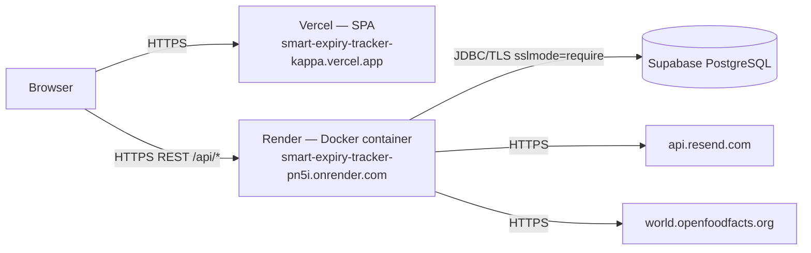

# 21 — Deployment Architecture

## Topology



## Render (backend API)

| Setting | Value / notes |
|---|---|
| Service type | Web Service |
| Runtime | Docker |
| Root directory | `backend` |
| Image | built from `backend/Dockerfile` (multi-stage) |
| Start command | container entrypoint (`java -jar app.jar`) |
| Port | Render injects `PORT`; app binds `server.port=${PORT:8080}` |
| Health check | `GET /api/health` → `{"status":"UP"}` |
| URL | `https://smart-expiry-tracker-pn5i.onrender.com` |

Required environment variables (set in Render's secret store — names only):

- `DB_URL` — JDBC URL, must start with `jdbc:postgresql:` (Supabase
  connection strings need the `jdbc:` prefix) and include
  `?sslmode=require` for TLS.
- `DB_USERNAME` — default `postgres`.
- `DB_PASSWORD` — required.
- `JWT_SECRET` — required, ≥ 32 bytes.
- Recommended: `CORS_ALLOWED_ORIGINS`, `RESEND_API_KEY`, `RESEND_FROM`,
  `AUTH_COOKIE_SECURE=true`, `AUTH_COOKIE_SAMESITE`.

Exact dashboard settings (build command, instance size, auto-deploy
triggers) are platform configuration — **Not verified from the current
source.**

## Vercel (frontend SPA)

| Setting | Value / notes |
|---|---|
| Build command | `npm run build` (`tsc -b && vite build`) |
| Output directory | `dist/` |
| Env var | `VITE_API_BASE_URL=https://smart-expiry-tracker-pn5i.onrender.com/api` (baked into the bundle) |
| URL | `https://smart-expiry-tracker-kappa.vercel.app` |
| SPA routing | `vercel.json` rewrite `/(.*)` → `/index.html` |

`vercel.json` (repo file):

```json
{
  "rewrites": [{ "source": "/(.*)", "destination": "/index.html" }]
}
```

This makes deep links (e.g. `/items/abc/edit`) serve the SPA instead of a
404; React Router then resolves the route and `AppShell` redirects unknown
paths to `/dashboard`.

Exact dashboard settings (framework detection, region, domain bindings) are
platform configuration — **Not verified from the current source.**

## Supabase (managed PostgreSQL)

- Used **only** as managed Postgres: no Supabase Auth, no Row-Level
  Security, no Storage, no Edge Functions (`supabase/config.toml` disables
  `[auth]`, `[storage]`, `[edge_functions]`; comments confirm this).
- Local CLI config (ports 54321–54324, Postgres 15) is for a local
  environment only; `supabase db push` must NOT be used — Flyway owns the
  schema.
- Connection: `DB_URL=jdbc:postgresql://<host>:5432/postgres?sslmode=require`.
- Schema is created by Flyway on first app boot (V1–V4).

## Deployment sequence

1. Backend changes: `cd backend && mvn -B -ntp test` → push → Render builds
   the Docker image and starts the container → Flyway migrates → health
   check passes.
2. Frontend changes: `npm run build` locally → push → Vercel builds and
   deploys `dist/`.
3. Verify production with the smoke test:
   `powershell -NoProfile -ExecutionPolicy Bypass -File .\production-smoke-test.ps1`

## URLs (verified live)

| Resource | URL |
|---|---|
| Frontend | https://smart-expiry-tracker-kappa.vercel.app |
| Backend | https://smart-expiry-tracker-pn5i.onrender.com |
| API base | https://smart-expiry-tracker-pn5i.onrender.com/api |
| Health | https://smart-expiry-tracker-pn5i.onrender.com/api/health → `{"status":"UP"}` |

## GitHub / CI

No `.github/` directory or workflow files exist in the repository. CI/CD
pipeline behavior (if any) is configured on the platforms, not in this repo
— **Not verified from the current source.**