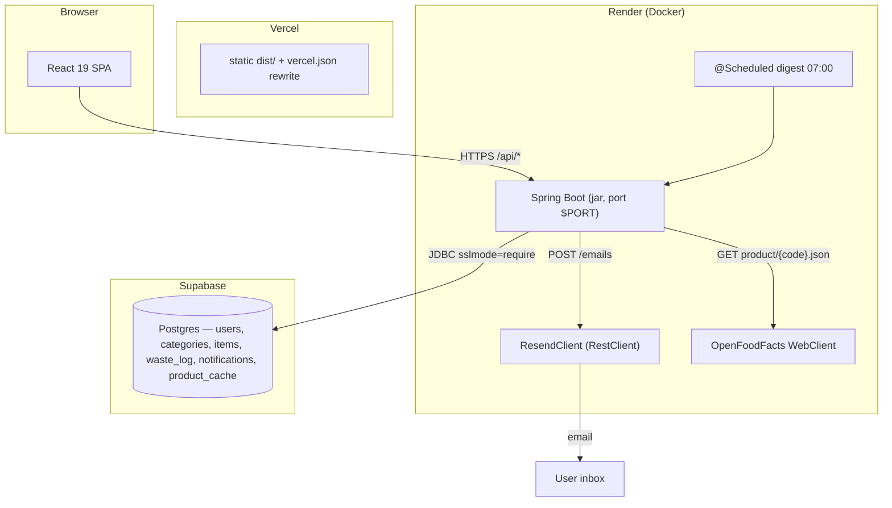

# Smart Expiry & Pantry Waste Tracker

## Complete Project Documentation (Master Document)

| | |
|---|---|
| **Project** | Smart Expiry & Pantry Waste Tracker |
| **Version** | 0.1.0 |
| **Frontend** | React 19 + Vite 6 + TypeScript 5.7 + Tailwind CSS 4 |
| **Backend** | Java 21 + Spring Boot 3.5.16 (Maven, jar) |
| **Database** | PostgreSQL (Supabase managed), Flyway-managed schema |
| **Email** | Resend HTTP API |
| **Deployments** | Render (API) · Vercel (web app) · Supabase (database) |
| **Verification** | 146 backend tests · green frontend build · production smoke test 15/15 PASS |
| **Companion docs** | See [docs/README.md](./README.md) for the full index |

> Every statement in this document is grounded in the actual repository
> source, configuration, migrations, and verified deployments. Anything that
> cannot be verified from the repository is explicitly marked
> **"Not verified from the current source."**

---

# 1. Project Overview

A full-stack web application that helps households stop wasting food and
medicine: users track pantry items, the app classifies each item as
**SAFE / EXPIRING / EXPIRED** using per-category warning thresholds, a daily
email digest warns about at-risk items, and waste events are recorded with
estimated cost and presented as monthly analytics. Items can be added by
camera/photo/manual barcode scanning with server-side Open Food Facts
lookup and a PostgreSQL cache.

- **Backend**: Java 21, Spring Boot 3.5.16 (Web, Security, Data JPA,
  Validation, Scheduling, WebFlux) in `backend/`, packaged as
  `pantry-tracker-backend-0.1.0.jar`.
- **Frontend**: React 19 + TypeScript + Vite 6 + Tailwind 4 at the repo
  root.
- **Database**: Supabase used **only** as managed PostgreSQL (no Supabase
  Auth, no RLS, no Edge Functions). Schema owned by Flyway (V1–V4).
- **Target users**: households reducing food/medicine waste; caregivers;
  anyone managing short-shelf-life items.
- **Main purpose**: Track → Warn → Quantify.

# 2. Problem Statement

Households waste food and medicine mainly because expiry dates are invisible
until it is too late, and no single warning window fits all item types
(perishables spoil in days, medicines last months). Waste is never measured,
so its cost is invisible too. Manual tracking is tedious, and third-party
barcode APIs are unreliable for direct browser use. Pantry data is personal
and must be strictly isolated per user.

# 3. Objectives

1. Personal pantry inventory with expiry tracking (CRUD, categories,
   quantities, notes).
2. Per-category expiry classification (SAFE / EXPIRING / EXPIRED).
3. One daily digest email per user, containing only that user's items,
   exactly once per item per day.
4. Waste recording with estimated cost and monthly analytics.
5. Barcode-based data entry (scan/photo/manual) with a server-side cache.
6. Security by design: BCrypt, short-lived access tokens, rotated
   HttpOnly-cookie refresh tokens, service-layer ownership checks, auth
   rate limiting.
7. Production-ready, verifiable deployment (Docker on Render, SPA on
   Vercel, Postgres on Supabase, 15-step production smoke test).

# 4. Scope

**In scope**: email/password auth with JWT + rotated refresh tokens; pantry
item CRUD with expiry tracking; per-category warning thresholds; daily
digest emails (Resend); waste logging with historical snapshots; monthly
waste analytics; barcode scanning + Open Food Facts lookup with Postgres
cache; USER/ADMIN roles with an admin digest trigger; health endpoint;
production smoke test.

**Out of scope** (by current design): third-party identity providers,
in-app push notifications, smart-appliance integration, multi-user
households, B2B inventory, Supabase Auth/RLS/Edge Functions.

# 5. Functional Requirements

| ID | Requirement | Status |
|---|---|---|
| FR-01 | Register (email, password ≥ 8, optional display name; duplicates → 409) | Implemented |
| FR-02 | Login (BCrypt verify; generic 401) | Implemented |
| FR-03 | Session restore on reload (refresh cookie → access token → `/auth/me`) | Implemented |
| FR-04 | Logout (clear cookie + revoke all refresh tokens) | Implemented |
| FR-05 | List categories (`GET /api/categories`) | Implemented |
| FR-06 | Create item (`POST /api/items`, category must exist) | Implemented |
| FR-07 | Read item (`GET /api/items/{id}`, 403 foreign / 404 missing) | Implemented |
| FR-08 | Update item (`PUT /api/items/{id}`) | Implemented |
| FR-09 | Delete item (`DELETE /api/items/{id}`, history survives) | Implemented |
| FR-10 | List with `search`/`category`/`status`/`sort`/`dir` | Implemented |
| FR-11 | Expiry status per category threshold | Implemented |
| FR-12 | Mark wasted (`POST /api/items/{id}/waste`, 0 < qty ≤ item qty, item deleted) | Implemented |
| FR-13 | Waste history (`GET /api/waste-log`, limit 1–100) | Implemented |
| FR-14 | Monthly analytics (`GET /api/analytics/monthly-waste`, months 1–24) | Implemented |
| FR-15 | Barcode lookup (`GET /api/barcode/{code}`, 8–14 digits, cached) | Implemented |
| FR-16 | Client-side EAN-13/EAN-8/UPC-A check-digit validation | Implemented |
| FR-17 | Daily digest email per user (own items only) | Implemented |
| FR-18 | Digest idempotency (unique DB index, UTC day) | Implemented |
| FR-19 | Health endpoint (`GET /api/health` → `{"status":"UP"}`) | Implemented |
| FR-20 | Admin digest trigger (`POST /api/admin/digest/test`) | Implemented |
| FR-21 | Auth rate limits (register 3/min, login 5/min, refresh 10/min per IP) | Implemented |
| FR-22 | Error contract `{"message":"..."}` for all errors | Implemented |
| FR-23 | Light/dark theme (persisted, system-preference aware) | Implemented |

# 6. Non-Functional Requirements

| Category | Requirement | Status |
|---|---|---|
| Performance | Index-backed per-user item listing (`items_owner_expiry_idx`) | Implemented |
| Performance | Repeat barcode scans served from `product_cache` | Implemented |
| Security | BCrypt passwords; JWT in memory only; HttpOnly refresh cookie | Implemented |
| Security | Replay-safe refresh (rotation + generation + row lock) | Implemented |
| Security | No cross-user access (`OwnershipGuard`) | Implemented |
| Security | Rate-limited auth endpoints per IP | Implemented |
| Reliability | Failed email sends never recorded → retried next run | Implemented |
| Reliability | Racing digest runs cannot double-notify (unique index) | Implemented |
| Reliability | Cache write failures never break lookups | Implemented |
| Maintainability | Flyway-versioned schema; feature-oriented packages | Implemented |
| Testability | 146 automated backend tests | Implemented |
| Operability | 15-step production smoke test | Implemented |
| Portability | Multi-stage Docker image, non-root user | Implemented |
| Compliance | No secrets in the repository (`.env*` ignored) | Implemented |
| UX | SPA deep links via `vercel.json` rewrite | Implemented |
| Scalability | Stateless JWT; horizontal API scaling possible | Design goal |
| Load/performance targets | No load testing performed | Not verified from the current source. |
| Browser matrix / accessibility | Modern evergreen assumed; Radix primitives | Not verified from the current source. |
| Backup/PITR | Supabase platform defaults | Not verified from the current source. |

# 7. Features

- **Authentication**: register/login, JWT access (60 min) in memory,
  rotated refresh (14 days) in an HttpOnly cookie at `Path=/api/auth`,
  generation-based revocation on logout, session restore, single-flight 401
  refresh, USER/ADMIN roles.
- **Pantry management**: add/edit/delete items (name, category, quantity
  1–999, unit with per-category suggestions, purchase/expiry dates,
  shelf-life auto-suggest, notes), search (debounced) + category/status
  filters + 4 sort keys, responsive table/cards, optimistic local updates.
- **Expiry tracking**: computed status SAFE/EXPIRING/EXPIRED with
  per-category thresholds (grocery 3, medicine 7, perishable 1 day),
  `daysUntilExpiry`, "Needs attention" list, summary cards, colored badges.
- **Categories**: seeded reference data (grocery, medicine, perishable).
- **Waste management**: mark wasted (partial or whole, optional cost in
  ₹), item deleted + `waste_log` snapshot row, recent-waste feed.
- **Analytics**: monthly waste API (1–24 months), trend line chart, KPI
  cards, monthly breakdown table, category donut.
- **Barcode**: camera scan (3-confirmation logic), photo decode (≤ 10 MB),
  manual entry with check-digit validation, server-side Open Food Facts
  lookup + Postgres cache, auto-fill of name/category.
- **Notifications/email**: daily digest at 07:00 (cron-configurable), one
  HTML email per user, idempotent per UTC day, dry-run without API key,
  admin manual trigger.
- **Platform**: health endpoint, SPA rewrites, production smoke test.

# 8. Technology Stack

| Layer | Technology | Version | Purpose |
|---|---|---|---|
| UI | React | 19.0.0 | Component model |
| Language | TypeScript | ~5.7.2 | Typed frontend |
| Build | Vite | ^6.0.5 (6.4.3 built) | Dev + bundle |
| Styling | Tailwind CSS | ^4.0.0 | Utility CSS |
| Routing | react-router-dom | ^7.1.1 | BrowserRouter SPA routing |
| HTTP | axios | ^1.7.9 | REST + interceptors |
| Charts | chart.js / react-chartjs-2 | ^4.4.7 / ^5.3.0 | Line + doughnut |
| Scanning | html5-qrcode | ^2.3.8 | Camera/photo barcode |
| Dates | date-fns | ^4.1.0 | Date formatting |
| Toasts | sonner | ^1.7.2 | Notifications |
| Icons | lucide-react | ^0.470.0 | Icons |
| UI primitives | Radix UI | 1.x | Accessible primitives |
| Backend | Java / Spring Boot | 21 / 3.5.16 | API framework |
| Build | Maven | 3.9+ | Build/packaging |
| JWT | JJWT | 0.12.6 | HS256 tokens |
| Persistence | Spring Data JPA / Hibernate | Boot-managed | ORM |
| Migrations | Flyway (core + postgresql) | Boot-managed | Schema versioning |
| DB | PostgreSQL | 15 (local CLI) / 16+ hosted | Datastore |
| Test DB | H2 (test scope) | Boot-managed | Embedded integration tests |
| Bytecode | byte-buddy | 1.18.10 (pinned) | Mockito agent compat |
| Email | Resend REST API | — | Digest emails |
| Barcode data | Open Food Facts | — | Product lookup |
| Container | Docker (multi-stage) | — | Render image |
| Hosting | Render · Vercel · Supabase | — | API · SPA · Postgres |

# 9. Project Structure

```
smart-expiry-tracker/
├── backend/                        # Spring Boot 3.5.16 (Java 21)
│   ├── Dockerfile                  # Multi-stage production image
│   ├── .dockerignore               # target/, .git/
│   ├── pom.xml                     # deps: web, webflux, data-jpa, security,
│   │                               #       validation, postgres, flyway, jjwt, h2(test)
│   └── src/
│       ├── main/java/com/pantrytracker/
│       │   ├── auth/               # JWT issue/validate, filter, login/register/refresh
│       │   ├── user/               # users entity + repository (USER/ADMIN)
│       │   ├── item/               # items, status logic
│       │   ├── category/           # reference data
│       │   ├── wastelog/           # waste logging
│       │   ├── analytics/          # monthly waste queries
│       │   ├── notification/       # digest job + recorder + template
│       │   ├── barcode/            # OFF lookup + product_cache
│       │   ├── email/              # Resend client
│       │   ├── common/             # exceptions, OwnershipGuard, health
│       │   └── config/             # SecurityConfig, CorsConfig, WebClientConfig
│       ├── main/resources/
│       │   ├── application.yml
│       │   └── db/migration/       # V1__init … V4__add_refresh_generation
│       └── test/                   # 17 classes, 146 tests + schema-h2.sql
├── src/                            # React 19 frontend (Vite)
│   ├── pages/                      # Dashboard, ItemList, ItemForm, Analytics,
│   │                               # Login, Register, Settings
│   ├── components/                 # feature components + ui/ primitives
│   ├── context/                    # AuthContext, ThemeContext
│   ├── hooks/                      # useItems
│   └── lib/                        # apiClient, types, status, dates, money,
│                                   # chart, barcodeValidation, useQuery, utils
├── supabase/config.toml            # local CLI only (auth/storage off)
├── vercel.json                     # SPA rewrite
├── production-smoke-test.ps1       # 15-step production verification
├── vite.config.ts, package.json, .env.example
└── docs/                           # this documentation package
```

# 10. System Architecture



**Principles** (from code): stateless JWT API; ownership enforced in the
service layer (no RLS); schema owned by Flyway (`ddl-auto=none`); statuses
computed on read; side effects idempotent (unique index, `REQUIRES_NEW`
writers).

# 11. System Context

Actors and external systems: the **User** (browser), the **SPA** (Vercel),
the **API** (Render), **Supabase PostgreSQL**, **Resend** (email), and
**Open Food Facts** (barcode data). The API is the only component that talks
to the database and the external services; the browser never calls Resend,
Open Food Facts, or the database directly.

# 12. Container Architecture

| Container | Host | Technology | Role |
|---|---|---|---|
| Web app (SPA) | Vercel | React 19 + Vite static build | UI, routing, auth state, charts, scanning |
| API | Render | Spring Boot 3.5.16 (Docker) | REST, auth, business logic, scheduling |
| Database | Supabase | PostgreSQL 16+ | Durable state (Flyway schema) |
| Email provider | Resend | REST API | Digest delivery |
| Barcode provider | Open Food Facts | REST API | Product data (cached in Postgres) |

See the flow diagrams in [06-SYSTEM-ARCHITECTURE.md](./06-SYSTEM-ARCHITECTURE.md)
(request flows, auth flow, digest flow, barcode flow).

# 13. Detailed System Design

- **Backend layers**: `SecurityConfig` + `JwtAuthFilter` → thin
  `@RestController`s (record DTOs) → `@Service`s with transactions and
  `OwnershipGuard` → Spring Data JPA repositories (incl. `FOR UPDATE`
  locks) → Flyway-managed Postgres.
- **Concurrency**: `markWasted` and refresh rotation use pessimistic row
  locks; digest notifications and product-cache writes use `REQUIRES_NEW`
  with unique-index protection; frontend 401 handling is single-flight.
- **Configuration**: env vars with defaults or fail-fast (`JWT_SECRET`,
  `DB_URL`, `DB_PASSWORD` required; `VITE_API_BASE_URL` required for build).
- **Errors**: `GlobalExceptionHandler` maps exceptions to status +
  `{"message":"..."}` (400/401/403/404/409/429).
- **Conventions**: `LocalDate` for item dates, `Instant` for timestamps;
  digest dedup uses the **UTC** day; costs formatted as INR on the frontend.
- **Frontend**: contexts (Auth, Theme) + `lib/useQuery` + `hooks/useItems`;
  controlled forms with client-side validation; lazy-loaded scanner;
  manual chunks (charts/scanner/radix) for caching.

# 14. Frontend Architecture

- **Entry** (`src/main.tsx`): `BrowserRouter` → `ThemeProvider` →
  `AuthProvider` → `App`.
- **Routing** (`App.tsx`): loading gate, auth redirects, routes
  `/login`, `/register`, `/dashboard`, `/items`, `/items/new`,
  `/items/:id/edit`, `/analytics`, `/settings`, fallback → `/dashboard`.
- **Auth state** (`AuthContext`): session restore, login/register/logout,
  `auth:unauthorized` listener.
- **API client** (`lib/apiClient.ts`): axios with `withCredentials`,
  in-memory token store, Bearer interceptor, single-flight 401 refresh.
- **Data**: `lib/useQuery` hook; `hooks/useItems` (items + categories with
  optimistic local mutations).
- **Forms**: `ItemFormFields` shared by modal/page/dialog — name/category
  required, quantity 1–999 with stepper and regex, unit suggestions,
  expiry auto-suggest from category defaults, shelf-life auto-calc, barcode
  auto-fill. `Register` enforces password ≥ 8.
- **Charts**: Chart.js line (`WasteChart`) and doughnut (`CategoryDonut`),
  theme-aware options.
- **Barcode**: `BarcodeScannerInput` — camera with 3-of-7 confirmation
  logic, photo decode ≤ 10 MB, manual entry with EAN-13/EAN-8/UPC-A
  check-digit validation.
- **Theming**: `ThemeContext` + pre-paint script in `index.html`
  (`pantry-theme`), Fraunces/Inter fonts.
- **Build**: `tsc -b && vite build`; throws without `VITE_API_BASE_URL`.

# 15. Backend Architecture

- Feature packages `auth user item category wastelog analytics notification
  barcode email common config` (see §9).
- **Security chain**: `JwtAuthFilter` (Bearer, `typ=access`) → stateless
  `SecurityConfig`; permitAll auth/health/error; `/api/admin/**` requires
  ROLE_ADMIN; everything else authenticated (401 entry point).
- **Rate limiting**: `AuthRateLimiter` — login 5/min, register 3/min,
  refresh 10/min per IP (`X-Forwarded-For`).
- **JWT**: HS256 (JJWT 0.12.6); access 60 min (`typ=access`), refresh
  14 days (`typ=refresh`, `gen`); secret required at startup.
- **Services** hold transactions; locks via `findOwnedForUpdate` /
  `findByIdForUpdate`; external calls never inside DB transactions.
- **Scheduling**: `@EnableScheduling` + `ExpiryDigestJob` at
  `DIGEST_CRON` (default `0 0 7 * * *`).
- **Testing**: Surefire with Mockito javaagent (JDK 21+); H2 test schema
  for locking tests.

# 16. Database Design

Six tables (see [10-DATABASE-DESIGN.md](./10-DATABASE-DESIGN.md) for full
column detail):

| Table | Key points |
|---|---|
| `users` | email UK, BCrypt `password_hash`, `role` enum, `refresh_generation` (V4) |
| `categories` | name UK; seeded: grocery (30/3), medicine (365/7), perishable (7/1) |
| `items` | owner FK cascade; quantity ≥ 0 CHECK; expiry index; updated_at trigger |
| `waste_log` | item FK `SET NULL`; snapshots item_name/unit (V3); qty > 0 CHECK |
| `notifications` | unique dedup `(item_id, type, utc-day)`; channel default 'email' |
| `product_cache` | PK barcode; `payload jsonb` |

Indexes: `items_owner_expiry_idx`, `items_barcode_idx`,
`waste_log_user_idx`, `notifications_dedup_idx` (UNIQUE),
`notifications_user_idx`. Enums: `user_role`, `notification_type`.
Migrations: V1 init → V2 seed → V3 waste snapshot → V4 refresh generation.

# 17. ER Diagram

```mermaid
erDiagram
    users ||--o{ items : owns
    users ||--o{ waste_log : wastes
    users ||--o{ notifications : receives
    categories ||--o{ items : classifies
    items ||--o{ waste_log : snapshotted
    items ||--o{ notifications : triggers

    users { uuid id PK; varchar email UK; varchar password_hash; varchar display_name; user_role role; timestamptz created_at; bigint refresh_generation }
    categories { uuid id PK; varchar name UK; integer default_shelf_life_days; integer warning_threshold_days }
    items { uuid id PK; uuid owner_id FK; varchar name; varchar barcode; uuid category_id FK; numeric quantity; varchar unit; date purchase_date; date expiry_date; integer shelf_life_days; text notes; timestamptz created_at; timestamptz updated_at }
    waste_log { uuid id PK; uuid item_id FK "set null"; uuid user_id FK; varchar item_name; varchar unit; numeric quantity_wasted; numeric estimated_cost_lost; timestamptz logged_at }
    notifications { uuid id PK; uuid item_id FK "cascade"; uuid user_id FK; notification_type type; varchar channel; timestamptz sent_at }
    product_cache { varchar barcode PK; jsonb payload; timestamptz fetched_at }
```

# 18. API Documentation

Base: `https://smart-expiry-tracker-pn5i.onrender.com/api` (local:
`http://localhost:8080/api`). Errors: `{"message":"..."}`.

**Public**: `GET /api/health`; `POST /api/auth/register` (3/min/IP);
`POST /api/auth/login` (5/min/IP); `POST /api/auth/refresh` (10/min/IP,
cookie); `POST /api/auth/logout`.

**Authenticated**: `GET /api/auth/me`; `GET /api/categories`;
`GET|POST /api/items` (filters: search/category/status/sort/dir);
`GET|PUT|DELETE /api/items/{id}`; `POST /api/items/{id}/waste`
(0 < qty ≤ item qty, then delete); `GET /api/waste-log?limit=20`;
`GET /api/analytics/monthly-waste?months=6`;
`GET /api/barcode/{code}` (8–14 digits).

**Admin**: `POST /api/admin/digest/test` (ROLE_ADMIN).

Key shapes: `TokenResponse{accessToken, user}` (refresh only in cookie);
`ItemResponse{id, ownerId, name, barcode, categoryId, category, quantity,
unit, purchaseDate, expiryDate, shelfLifeDays, defaultShelfLifeDays,
warningThresholdDays, notes, status, daysUntilExpiry, createdAt, updatedAt}`;
`MonthlyWasteResponse{months[], totalCostLost, totalWasted}`;
`LookupResult{barcode, name, brand, category, cached}`.

Status map: 400 validation/bad input · 401 credentials/token · 403
ownership/role · 404 missing · 409 duplicate email · 429 rate limit.
Full payloads: [12-API-DOCUMENTATION.md](./12-API-DOCUMENTATION.md).

# 19. Authentication

- **Tokens**: access JWT (60 min, `typ=access`, bearer header, memory only)
  + refresh JWT (14 days, `typ=refresh`, `gen` claim, HttpOnly cookie).
- **Rotation**: refresh validates the generation under a pessimistic user
  row lock, bumps it, and re-issues — a used token can never be replayed.
- **Logout**: bumps the generation (revokes every outstanding refresh
  token) and clears the cookie.
- **Session restore**: frontend trades the cookie for a new access token
  then calls `/auth/me`; parallel 401s share a single refresh
  (single-flight) and a failed refresh triggers `auth:unauthorized`.

# 20. Security

BCrypt password hashing; secrets only in env vars (`.env*` ignored,
`.env.example` placeholders); stateless JWT filter with `typ` separation;
`OwnershipGuard` (403 for foreign resources — no existence oracle);
`@PreAuthorize` for admin; CSRF not applicable (stateless, SameSite=Lax
cookie, rate-limited refresh); XSS mitigated (in-memory tokens, React
escaping, HTML-escaped email content); CORS allowlist; per-IP auth rate
limits; generic login errors; Bean Validation + regex on inputs; byte-buddy
pinned to 1.18.10. Actual secret values are intentionally absent from this
repository and documentation.

# 21. CORS

`CorsConfig` — exact origins from `CORS_ALLOWED_ORIGINS` (comma-separated,
no wildcard, required for credentials); methods `GET, POST, PUT, PATCH,
DELETE, OPTIONS`; headers `Authorization, Content-Type`; maxAge 3600 s.

# 22. Business Logic

- **Status**: no expiry → SAFE; before today → EXPIRED; ≤ today+threshold →
  EXPIRING; else SAFE. Threshold from the item's category.
- **Listing**: index-backed base query + in-memory search/category/status
  filters + expiry/name/created/category sort with direction.
- **Ownership**: every item operation resolves + checks owner (403), or
  scopes the locking query by owner.
- **Waste**: locked read → validate quantity (default full) → write
  `WasteLog` with null item ref + snapshot → delete item.
- **Digest**: group items by owner, skip SAFE/no-expiry/already-notified,
  send one email per user outside transactions, record notifications only
  on success (REQUIRES_NEW).
- **Barcode**: regex gate → cache hit → OFF fetch (10 s) → status check →
  isolated cache write.
- **Analytics**: per-month waste count + cost sum + items added, 1–24
  months, user-scoped.
- **Validation**: Bean Validation on DTOs; DB CHECKs (`quantity >= 0`,
  `quantity_wasted > 0`, `estimated_cost_lost >= 0`); barcode regex.

# 23. Item Lifecycle

`create → Active(SAFE/EXPIRING/EXPIRED computed) → update/delete/waste`.
Status is derived per read; waste always deletes the item and writes a
snapshot; delete keeps history via `ON DELETE SET NULL` + snapshots;
digest notifications are recorded per UTC day without touching the item.
Diagram: [15-ITEM-LIFECYCLE.md](./15-ITEM-LIFECYCLE.md).

# 24. Waste Management

`POST /api/items/{id}/waste` — optional `quantityWasted` (defaults to full)
and `estimatedCostLost`; 0 < qty ≤ item qty; row locked; `WasteLog` written
with item_name/unit snapshot; item deleted in the same transaction.
History: `GET /api/waste-log` (limit 1–100, newest first). Concurrency:
`findOwnedForUpdate` serializes racing waste calls (verified by
`MarkWastedConcurrencyTest`).

# 25. Analytics

`AnalyticsService.monthlyWaste(userId, months)` — for each of the last
1–24 months: `wastedItems` (waste_log count), `costLost` (sum of non-null
estimates), `totalItems` (items added); plus totals. Frontend: 3/6/12-month
selector, KPI cards, rose line trend chart, monthly breakdown table,
category donut. Costs formatted INR.

# 26. Barcode

Client: camera scan (html5-qrcode, 3-consistent-reads confirmation with 2×
margin and 3 s window), photo decode (≤ 10 MB), manual entry with EAN-13/
EAN-8/UPC-A check digits. Server: `^\d{8,14}$` gate → `product_cache` hit →
Open Food Facts `/api/v2/product/{code}.json` (10 s timeout, custom
User-Agent) → status check → `ProductCacheWriter` (REQUIRES_NEW, failures
swallowed) → `LookupResult{barcode, name, brand, category, cached}`.

# 27. Email / Notifications

`ExpiryDigestJob` (`@Scheduled`, `DIGEST_CRON` default `0 0 7 * * *`) →
`ExpiryDigestService.run()`: per user, one HTML email (subject
"Pantry digest: N expiring, M expired") with escaped item names, via
`ResendClient` (`POST api.resend.com/emails`, Bearer key, 5 s/10 s
timeouts; dry-run logs counts when the key is unset). Idempotency:
`alreadyNotifiedToday` pre-check + unique index `(item_id, type, utc-day)`
+ `REQUIRES_NEW` recorder that swallows duplicates; only successful sends
are recorded (retried later). Admin trigger: `POST /api/admin/digest/test`
(+ "Test digest now" on Settings for admins).

# 28. Docker

`backend/Dockerfile` — multi-stage: `maven:3.9-eclipse-temurin-21` build
(`dependency:go-offline`, `-DskipTests package`, `.m2` cache mount) →
`eclipse-temurin:21-jre` runtime with non-root `app` user,
`COPY --from=build /build/target/*.jar /app/app.jar`,
`ENTRYPOINT ["java","-jar","/app/app.jar"]`; `EXPOSE 8080` informational
(app binds `${PORT:8080}`). `.dockerignore`: `target/`, `.git/`. Verified:
build OK; container run against a throwaway Postgres applied Flyway V1–V4
and served `/api/health` UP. Legacy compose/nginx files were removed by
project decision.

# 29. Deployment

- **Render** — Web Service, Docker runtime, Root Directory `backend`;
  injects `PORT`; health check `/api/health`; URL
  `https://smart-expiry-tracker-pn5i.onrender.com`. Dashboard settings
  beyond this: Not verified from the current source.
- **Vercel** — `npm run build` → `dist/`; `VITE_API_BASE_URL` set at build;
  URL `https://smart-expiry-tracker-kappa.vercel.app`; `vercel.json`
  rewrite `/(.*)` → `/index.html` for SPA deep links.
- **Supabase** — managed PostgreSQL only (`supabase/config.toml` disables
  auth/storage/edge functions; `supabase db push` must not be used);
  connection via `jdbc:`-prefixed `DB_URL` with `sslmode=require`.
- No `.github/` CI files in the repo — pipeline behavior: Not verified from
  the current source.

# 30. Environment Variables

Names and purpose only (see [22-ENVIRONMENT-CONFIGURATION.md](./22-ENVIRONMENT-CONFIGURATION.md)):

| Variable | Default | Required |
|---|---|---|
| `DB_URL` (JDBC `jdbc:postgresql:`, `sslmode=require`) | — | yes |
| `DB_USERNAME` | `postgres` | no |
| `DB_PASSWORD` | — | yes |
| `JWT_SECRET` (≥ 32 bytes) | — | yes |
| `JWT_ACCESS_TTL_MINUTES` | `60` | no |
| `JWT_REFRESH_TTL_DAYS` | `14` | no |
| `RESEND_API_KEY` (empty = dry-run) | empty | no |
| `RESEND_FROM` | `Pantry Tracker <onboarding@resend.dev>` | no |
| `DIGEST_CRON` | `0 0 7 * * *` | no |
| `CORS_ALLOWED_ORIGINS` | `http://localhost:5173` | no |
| `AUTH_COOKIE_SECURE` (true in prod) | `false` | no |
| `AUTH_COOKIE_SAMESITE` | `Lax` | no |
| `PORT` | `8080` | no |
| `FLYWAY_ENABLED` | `true` | no |
| `VITE_API_BASE_URL` | — | yes (frontend build) |

No `application-prod.yml` exists; production is configured via env vars.

# 31. Testing

- **Backend**: `mvn -B -ntp test` — 146 tests, 0 failures across 17
  classes: auth service/JWT/rate-limiter, security MVC + secure cookies,
  item service/status, mark-wasted concurrency, barcode service + cache
  writer, Resend client, digest service + recorder, analytics, enum
  mappings, context load. H2 test schema mirrors entities; Mockito runs as
  a Java agent (pom argLine).
- **Frontend**: no unit framework; `npm run build` (`tsc -b && vite build`)
  is the gate — verified green (2105 modules).
- **Smoke test**: `production-smoke-test.ps1` — 15 checks against the live
  API; final run **15/15 PASS** (see §32).

# 32. Production Verification

| Check | Result |
|---|---|
| Backend tests | 146/146 PASS |
| Docker build + container run (Flyway V1–V4, health) | UP |
| Frontend build | green |
| Production smoke test | 15/15 PASS |
| Live health | `{"status":"UP"}` at `https://smart-expiry-tracker-pn5i.onrender.com/api/health` |

Smoke-test steps: health · register · login · refresh · `/auth/me` ·
categories · create item · get item · update item · mark wasted (item
deleted) · list (item absent) · delete (404) · unauthenticated `/me` (401)
· logout · refresh after logout (401). Script uses unique throwaway
credentials, sanitized output, and PS 5.1 workarounds
(`-UseBasicParsing`, array unwrap, session-header clearing).

# 33. Problems Encountered

| # | Problem |
|---|---|
| P1 | PowerShell 5.1 `Invoke-WebRequest` hung on the Cloudflare-fronted API |
| P2 | PS 5.1 double-wrapped JSON arrays (`[[{…}]]`) broke parsing |
| P3 | PS 5.1 `WebSession` replayed the stale `Authorization` header |
| P4 | Smoke-test assumptions contradicted `markWasted` deleting the item |
| P5 | Vercel 404 on SPA deep links |
| P6 | Redundant legacy Docker files (root Dockerfile, compose, nginx, 2× .dockerignore) |

# 34. Root Causes

P1: PS 5.1's default DOM parser (mshtml) stalls on slow JSON responses.
P2: `ConvertFrom-Json` in PS 5.1 wraps a top-level array as a single-element
array (fixed in PS 7). P3: session object merged stale headers into
subsequent requests after rotation. P4: domain rule — waste logging ends
the item's life by design. P5: static hosting has no fallback for unknown
paths before the SPA router runs. P6: an earlier single-container serving
plan that the Vercel + Render split made obsolete.

# 35. Solutions

P1: `-UseBasicParsing` + 30 s timeout. P2: `ConvertFrom-ApiJson` unwrap
helper. P3: `$script:Session.Headers.Clear()` per request. P4: assertions
updated to expect the item absent + 404 on delete. P5: `vercel.json`
rewrite `/(.*)` → `/index.html`. P6: deleted the six legacy files; created
the production-ready `backend/Dockerfile` (multi-stage, non-root) +
`.dockerignore`, verified by build and a local container run.

# 36. Troubleshooting

Key entries (full tables in [24-TROUBLESHOOTING.md](./24-TROUBLESHOOTING.md)):

- Startup: missing `JWT_SECRET`/`DB_URL`/`DB_PASSWORD` → set env vars;
  wrong URL prefix → add `jdbc:`; Flyway drift → new migrations only.
- Auth: 401 refresh → re-login, check cookie path/`Secure`/`SameSite`;
  429 → rate limits; CORS errors → allowlist the origin.
- Email: no digest → `RESEND_API_KEY` missing (dry-run) or sender
  unverified; duplicates → verify dedup index / single instance.
- Items: item gone after waste → by design (snapshot in `waste_log`);
  403 → ownership; delete 404 → already deleted.
- Barcode: invalid format/not found/unavailable → respective 400 messages;
  camera issues → friendly UI messages.
- Frontend: deep-link 404 → vercel.json; build failure → set
  `VITE_API_BASE_URL`.

# 37. Operations

Daily: check `/api/health`, digest logs at 07:00, run the smoke test.
Deploys: backend (`mvn test` → push → Render builds → verify) and frontend
(`npm run build` → push → Vercel → verify deep links). Schema: new
`V5__*.sql`, verify on throwaway Postgres, deploy, check
`flyway_schema_history`; never hand-edit production tables. Secrets:
rotate in the secret store, redeploy (refresh tokens invalidate; users
re-login). Manual digest: admin Settings → "Test digest now".
Incidents: health → DB → digest logs → smoke test → rollback.
Backups: Supabase platform feature (recovery procedures: Not verified from
the current source).

# 38. Release Checklist

- [ ] `mvn -B -ntp test` green (146).
- [ ] `npm run build` green.
- [ ] No secrets in git; env vars set in the target environment
      (`DB_URL`, `DB_PASSWORD`, `JWT_SECRET`, `CORS_ALLOWED_ORIGINS`,
      `AUTH_COOKIE_SECURE=true`, `VITE_API_BASE_URL`).
- [ ] Migrations verified against a fresh DB; `flyway_schema_history`
      correct on the target.
- [ ] `/api/health` UP; smoke test 15/15 PASS.
- [ ] Manual spot checks: auth flow, item lifecycle, waste → analytics,
      barcode lookup, digest (email or dry-run), admin digest test,
      deep links.

# 39. Future Enhancements

Proposals (none implemented): notification preferences/in-app inbox
(`notifications.channel` ready), push channels, category admin UI, item
images/shopping lists, restore-from-waste, CSV import/export, household
multi-user model; engineering: distributed lock for the digest job (for
multi-instance), Prometheus metrics/alerting, Playwright E2E, load tests,
refresh-token families, item-list pagination, email verification/password
reset, shared rate-limit store, i18n; operations: CI pipeline, staging
environment, backup restore drills. Deliberately not planned: Supabase
Auth/RLS/Edge Functions, local compose/nginx serving.

# 40. Final Architecture Summary

The Smart Expiry & Pantry Waste Tracker is a three-tier, stateless, fully
web-hosted system:

1. **Presentation** — React 19 SPA on Vercel: in-memory JWT access tokens,
   HttpOnly refresh cookie, single-flight refresh, responsive pantry UI,
   Chart.js analytics, camera/photo/manual barcode entry with client-side
   check-digit validation, per-category status coloring, light/dark theme.
2. **Application** — Spring Boot 3.5.16 on Render (Docker, non-root,
   `$PORT`): stateless JWT security with rotation + generation-based
   revocation, per-IP rate limits, ownership-checked services, pessimistic
   locks for waste and refresh, Flyway-managed schema, scheduled daily
   digest with DB-level idempotency, cached Open Food Facts lookups.
3. **Data & integration** — Supabase PostgreSQL (six tables, CHECK
   constraints, targeted indexes, unique dedup index) as the single source
   of truth; Resend for email; Open Food Facts for product data.

The whole chain is verified: 146 unit/integration tests, a green
type-checked production build, a Docker image validated end-to-end, and a
15-step production smoke test passing 15/15 against the live deployment.
Design strengths: strict per-user isolation without RLS, replay-safe
refresh tokens, idempotent side effects, and no secrets in the repository.
Known limits: digest job assumes a single instance; load/browser-matrix
testing is not performed; analytics costs are user-entered estimates.

---

*Generated from the actual source code, configuration, migrations and
verified deployments of the repository. No secrets, credentials, or personal
details are included. Companion index: [docs/README.md](./README.md).*